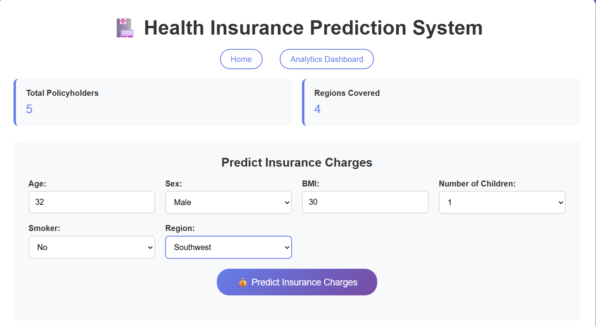

# Health Insurance Cost Prediction & Analysis 🩺
[➡️ View the Full Analysis Notebook](Health Insurance.ipynb)
## Project Overview

This project provides a comprehensive analysis of a health insurance dataset. The primary goal is to identify the key factors that influence medical insurance charges and to build a predictive model that can estimate costs for new policyholders.

The project includes:
-   In-depth Exploratory Data Analysis (EDA) to understand the data's underlying patterns.
-   An interactive Power BI dashboard for a high-level business intelligence overview.
-   A machine learning model deployed in a web application to deliver real-time predictions.

---

## 📊 Exploratory Data Analysis (EDA)

Several visualizations were created to uncover insights from the data.

### Impact of Smoking on Charges
The analysis clearly shows that smoking is a major driver of higher insurance costs. As seen in the scatter plot, smokers (in orange) consistently have higher charges across all age groups compared to non-smokers (in blue).

### Impact of BMI on Charges
There is a noticeable trend that higher Body Mass Index (BMI) correlates with increased insurance charges, especially for individuals with a BMI above 30.

### Effect of Number of Children
The number of children a policyholder has also impacts their insurance charges. The bar chart shows how the average charges vary based on the number of dependents.

### Distribution of Dependents
This visualization shows the distribution of policyholders based on the number of children they have. The majority of individuals in this dataset have no children.

### Correlation Analysis
A heatmap was used to analyze the correlation between different numerical features in the dataset. This helps in understanding the relationships between variables like age, BMI, and charges.

---

## 📈 Interactive Power BI Dashboard

For a more dynamic and high-level view, an interactive dashboard was created using Power BI. This allows for filtering and slicing the data to explore trends across different demographic groups and regions.

---

## 🤖 Machine Learning Prediction Model

A machine learning model was trained on the dataset to predict insurance charges. This model has been deployed into a user-friendly web application.

### Web Application Interface
The user can input their details such as age, BMI, number of children, and smoking status into the web form.

### Prediction Results
After submitting the form, the application displays the predicted insurance charge. The examples below show different outputs from the model.

---

## 🛠️ Tech Stack

-   **Data Analysis:** Python, Pandas, Matplotlib, Seaborn
-   **Machine Learning:** Scikit-learn
-   **Business Intelligence:** Power BI
-   **Web Application:** Flask / Streamlit (or other Python web framework)
-   **Version Control:** Git & GitHub
